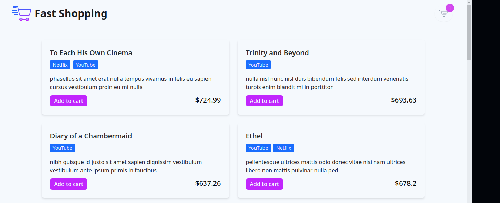

# FAST SHOPPING <!-- omit in toc -->

## Contents <!-- omit in toc -->

- [How to run](#how-to-run)
  - [Prerequisite](#prerequisite)
  - [Setup the db](#setup-the-db)
  - [Installing dependencies](#installing-dependencies)
  - [Configure env](#configure-env)
  - [Running](#running)
- [Screenshots](#screenshots)
  - [Desktop version](#desktop-version)
  - [Mobile version](#mobile-version)
- [Demo](#demo)
- [Additional comments](#additional-comments)

## How to run

### Prerequisite

- Docker

### Setup the db

1. Clone this repo
2. Go to fast-shopping
3. Run `docker-compose up --build`
4. Run `docker-compose exec db bash` in a new terminal
5. Run `mysql -h localhost -u root -p` and type the root password that `docker-compose` contains
6. choose one of the scripts inside the db directory and run it by typing `source ../app/scripts/the-selected-script` in mysql console
7. you can exit the `db` container but do not kill the `compose`

### Installing dependencies

Now that the db is ready, it's time to install the project's dependencies

1. Run `docker-compose exec api bash`
2. Run `npm install`
3. Rou can exit the container
   Repeat this steps for the `front` container and then exit the `compose`

### Configure env

1. Go to front/app/
2. Create an .env file and set its values (in `front/app/` you can find an example)

```text
REACT_APP_API_HOST=localhost
REACT_APP_API_PORT=8081
```

### Running

1. Comment these line in the docker-compose for both services

   ```yml
   stdin_open: true
   tty: true
   entrypoint: bash
   ```

2. Run again `docker-compose up --build` (I promise this is the last one 😓)

Now the app is exposed at `http://localhost:3000/`

## Screenshots

### Desktop version

<code>
   
</code>

### Mobile version

<code>
  
</code>

## Demo

- [Ver demo en  Google Drive](https://drive.google.com/file/d/15RrBcXr68oNM0M_nHnPoNP0LU54A3IsC/view?usp=drivesdk)

## Additional comments

- The ER diagram is hosted by [Creately](https://app.creately.com/diagram/5sWufJsFFFX)
- Icons provided by [Icons8](https://icons8.com/)
